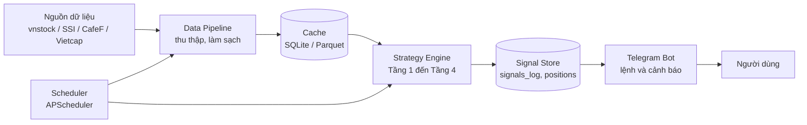

# Fintech Signal Bot

**Telegram Bot phát tín hiệu Mua/Bán cổ phiếu Việt Nam theo chiến lược Regime-Adaptive Quality Momentum và Dynamic ATR Sizing**


[Dùng thử Bot](https://t.me/<ten_bot>) · [Kiến trúc](#3-kiến-trúc-hệ-thống) · [Chiến lược](#4-chiến-lược-đầu-tư) · [Cài đặt và chạy](#6-cài-đặt-và-hướng-dẫn-chạy) · [Backtest](#8-đánh-giá-hiệu-năng-backtesting)

</div>

---

## 1. Giới thiệu

**Fintech Signal Bot** là hệ thống Telegram Bot tự động thu thập dữ liệu thị trường chứng khoán Việt Nam, xử lý theo một chiến lược đầu tư có căn cứ và gửi tín hiệu Mua/Bán đến người dùng gần như theo thời gian thực.

Thay vì dựa vào một chỉ báo đơn lẻ, bot kết hợp **phân tích cơ bản** (chất lượng doanh nghiệp) với **phân tích kỹ thuật** (xu hướng, động lượng, biến động) trong một quy trình bốn tầng. Mỗi tầng dùng đúng khung thời gian phù hợp với bản chất dữ liệu của nó: báo cáo tài chính theo quý, giá đóng cửa theo ngày và nến 15 phút cho tín hiệu trong phiên.

Dự án được thực hiện trong khuôn khổ **Bài tập 3: Xây dựng Telegram Bot tín hiệu đầu tư chứng khoán (Fintech Bot)**.

### Điểm nổi bật

| Đặc điểm | Mô tả |
|---|---|
| Đa tầng, đa khung thời gian | Quality (quý) → Regime và RS (ngày) → Momentum (15 phút) → ATR Risk (ngày) |
| Trường phái đầu tư | Kế thừa CANSLIM (William O'Neil), Growth Investing (Philip Fisher), Momentum Investing (Jegadeesh và Titman) |
| Quản trị rủi ro động | Stop Loss, chốt lời và khối lượng đều tính từ ATR14 Daily, không dùng tỷ lệ phần trăm cố định |
| Chốt lời hai giai đoạn | Chốt 50% tại mục tiêu 4×ATR, 50% còn lại chạy theo Trailing Stop |
| Tránh look-ahead bias | Báo cáo tài chính chỉ được dùng kể từ ngày công bố (`announcement_date`) |
| Tương tác qua Telegram | Xem tín hiệu hôm nay, tra cứu từng mã, đăng ký nhận cảnh báo tự động |

---

## 2. Tính năng

### Lệnh của Bot

| Lệnh | Chức năng |
|---|---|
| `/start` | Khởi động bot và xem hướng dẫn nhanh |
| `/help` | Danh sách lệnh và giải thích ngắn về chiến lược |
| `/signals` | Danh sách tín hiệu BUY/SELL của ngày hôm nay |
| `/check <mã>` | Tra cứu trạng thái và điểm mua/bán của một mã, ví dụ `/check FPT` |
| `/subscribe` | Đăng ký nhận cảnh báo tự động khi có tín hiệu mới |
| `/unsubscribe` | Hủy đăng ký cảnh báo |

### Nội dung một tín hiệu BUY (ví dụ minh họa)

```text
TÍN HIỆU MUA: FPT
Thời điểm      : 10:45 (nến 15 phút)
Giá vào lệnh   : 50.000
Stop Loss      : 48.000   (Entry − 2×ATR14)
Chốt lời 50%   : 54.000   (Entry + 4×ATR14)
Khối lượng gợi ý: 500 cổ phiếu (Capital 100 triệu, Risk 1%)
Lý do          : Quality PASS | RS ≥ 60 | Bullish | Momentum 2/2
```

---

## 3. Kiến trúc hệ thống

Luồng dữ liệu đi từ nguồn dữ liệu thị trường, qua lớp thu thập và lưu đệm, vào bộ máy chiến lược, rồi được đẩy đến người dùng qua Telegram.



### Ba module tách biệt

| Module | Trách nhiệm | Thư mục |
|---|---|---|
| Lấy dữ liệu | Thu thập giá, khối lượng, VN-Index, nến 15 phút và báo cáo tài chính; xử lý lỗi và lưu đệm | `data/` |
| Tính toán | Bốn tầng chiến lược, sinh tín hiệu và quản lý vị thế | `strategy/` |
| Bot | Nhận lệnh, định dạng tin nhắn, gửi cảnh báo | `bot/` |

---

## 4. Chiến lược đầu tư

**Regime-Adaptive Quality Momentum và Dynamic ATR Sizing**

```text
Chất lượng doanh nghiệp → Xu hướng thị trường → Tín hiệu Momentum trong ngày → Quản trị rủi ro bằng ATR
```

Bot chỉ phát tín hiệu BUY khi **cả bốn** điều kiện sau đồng thời thỏa:

```text
Quality PASS  ∧  RS Percentile ≥ 60  ∧  Regime = Bullish  ∧  Momentum Score = 2
```

### Tầng 1. Quality Filter (dữ liệu báo cáo tài chính, theo quý)

Chỉ cho phép doanh nghiệp có nền tảng tốt đi vào các bước kỹ thuật. Nếu không đạt Quality PASS, bot **không** phát BUY dù tín hiệu kỹ thuật đẹp đến đâu.

$$
\text{ProfitGrowth}_{YoY}=\frac{Profit_t-Profit_{t-4}}{Profit_{t-4}}\times 100\%
$$

$$
ROE_{TTM}=\frac{NetIncome}{AverageEquity}\times 100\%
$$

| Điều kiện | Ngưỡng |
|---|---|
| Tăng trưởng lợi nhuận sau thuế so với cùng kỳ | `ProfitGrowth_YoY ≥ 15%` |
| Hiệu quả sử dụng vốn chủ sở hữu | `ROE_TTM ≥ 10%` |
| **Quality PASS** | Thỏa đồng thời cả hai điều kiện |

### Tầng 2. Daily Filter: Relative Strength và Market Regime (giá đóng cửa ngày)

**Relative Strength 6 tháng**

$$
Return_{6M}=\frac{Price_t-Price_{t-126}}{Price_{t-126}}\times 100\%
$$

Mức tăng 6 tháng của từng mã được xếp hạng trong universe theo dõi để ra `RS Percentile`. Điều kiện: `RS Percentile ≥ 60`.

**Market Regime** dựa trên VN-Index và đường SMA200:

$$
SMA200_t=\frac{1}{200}\sum_{i=0}^{199}Close_{t-i}
$$

| Trạng thái | Điều kiện | Quy tắc |
|---|---|---|
| Bullish | VN-Index > SMA200 | Cho phép chuyển sang Tầng 3 |
| Non-Bullish | VN-Index ≤ SMA200 | Không mở vị thế BUY mới |

### Tầng 3. Intraday Momentum Trigger (nến 15 phút)

Tầng tạo ra tín hiệu BUY trong phiên. Mọi chỉ báo đều tính trên nến 15 phút, không trộn với dữ liệu ngày.

| Điều kiện | Công thức | Điểm |
|---|---|---|
| Xu hướng ngắn hạn mạnh hơn trung hạn | `EMA20_15m > EMA50_15m` | +1 |
| Volume đột biến kèm giá tăng | `Volume ≥ 1.3 × MA20(Volume)` và `Close_t > Close_{t-1}` | +1 |
| **Momentum Score** | Tổng điểm | 0 đến 2 |

Ngưỡng BUY: `Momentum Score = 2` khi thị trường ở trạng thái Bullish.

### Tầng 4. Dynamic ATR Risk Management

Bot không dùng Stop Loss cố định (5% hay 8%). Toàn bộ cắt lỗ, chốt lời và khối lượng đều xuất phát từ một đại lượng duy nhất là `ATR_E`. Chiến lược nắm giữ theo T+2 nên ATR được đo trên dữ liệu **Daily**, còn khung 15 phút chỉ dùng để xác định thời điểm vào lệnh.

**4.1. Đo biến động**

$$
TR_t=\max\left(High_t-Low_t,\ |High_t-Close_{t-1}|,\ |Low_t-Close_{t-1}|\right)
$$

$$
ATR14_t=\frac{1}{14}\sum_{i=0}^{13}TR_{t-i}
$$

`ATR_E` là ATR14 Daily của phiên đóng cửa gần nhất trước khi vào lệnh, giữ cố định trong suốt vòng đời vị thế.

**4.2. Các mức giá**

| Mức | Công thức | Vai trò |
|---|---|---|
| Khoảng rủi ro `R` | `R = 2 × ATR_E` | Đơn vị đo rủi ro trên mỗi cổ phiếu |
| **Cắt lỗ** | `Stop_0 = Entry − R` | Mức dừng lỗ ban đầu |
| **Chốt lời một phần** | `TP = Entry + 4 × ATR_E` | Chốt 50% khối lượng (R:R = 1:2) |
| **Trailing Stop** | `Stop_t = max(Stop_{t-1}, HH_t − R)` | Khóa lãi, chỉ tăng không giảm |

Trong đó `HH_t` là đỉnh High Daily cao nhất kể từ ngày vào lệnh (tối thiểu bằng `Entry`). Stop được cập nhật cuối phiên và được kiểm tra realtime trong phiên. Khi `Stop_t` vượt lên trên `Entry`, mức dừng này chuyển từ cắt lỗ thành chốt lời bảo toàn.

**4.3. Position Sizing**

$$
RiskCapital=Capital\times Risk\%
$$

$$
Shares=\left\lfloor \frac{\min\left(\dfrac{RiskCapital}{R},\ \dfrac{Capital\times w_{max}}{Entry}\right)}{100}\right\rfloor\times 100
$$

`w_max` là trần tỷ trọng mỗi mã, ngăn bot dồn quá nhiều vốn vào cổ phiếu có ATR rất nhỏ. Khối lượng được làm tròn xuống theo lô 100 cổ phiếu.

**4.4. Quy tắc SELL**

| Mã | Tên | Điều kiện | Loại |
|---|---|---|---|
| **S1a** | ATR Stop Loss | `CurrentPrice ≤ Stop_t` và `Stop_t < Entry` | Thoát lỗ |
| **S1b** | ATR Trailing Stop | `CurrentPrice ≤ Stop_t` và `Stop_t ≥ Entry` | Chốt lời |
| **S4** | Partial Take Profit | `CurrentPrice ≥ Entry + 4 × ATR_E`, kích hoạt một lần | Chốt lời 50% |
| **S2** | Trend Exit | `EMA20_15m < EMA50_15m` trong 2 nến 15 phút liên tiếp | Theo xu hướng |
| **S3** | Fundamental Exit | Có báo cáo tài chính mới và `ProfitGrowth_YoY < 0` | Theo cơ bản |

Thứ tự ưu tiên khi nhiều điều kiện cùng thỏa: **S1 → S4 → S2 → S3**.

Sau khi S4 kích hoạt, 50% còn lại được bảo vệ bằng Trailing Stop `2×ATR` tính từ đỉnh, đồng thời vẫn chịu S2 và S3. Nếu tổng khối lượng dưới 200 cổ phiếu (không chia được theo lô 100), bot chốt toàn bộ tại mức TP.

**Ví dụ minh họa** (Capital 100.000.000 đồng, Risk 1%, Entry 50.000 đồng, ATR_E 1.000 đồng)

| Đại lượng | Giá trị |
|---|---|
| `R` | 2 × 1.000 = 2.000 đồng |
| Stop Loss ban đầu | 50.000 − 2.000 = 48.000 đồng |
| Mức chốt lời TP | 50.000 + 4.000 = 54.000 đồng |
| Khối lượng | min(1.000.000 / 2.000 ; 30.000.000 / 50.000) = 500 cổ phiếu |
| Chạm Stop Loss | Lỗ 1.000.000 đồng (1% vốn) |
| Chạm TP | Bán 200 cổ phiếu, lãi 800.000 đồng; Stop của 300 cổ phiếu còn lại nâng lên 52.000 đồng |

---

## 5. Dữ liệu đầu vào

| Nhóm | Trường dữ liệu | Dùng cho |
|---|---|---|
| Market Data (ngày) | `ticker`, `date`, `open`, `high`, `low`, `close`, `volume` | RS 6 tháng, ATR14, Trailing Stop |
| VN-Index | `index_date`, `index_close` | SMA200 và Market Regime |
| Financial Data | `period`, `net_profit`, `roe_ttm`, `announcement_date` | Quality Filter, S3 (chống look-ahead bias) |
| Intraday (15 phút) | `datetime`, `open_15m`, `high_15m`, `low_15m`, `close_15m`, `volume_15m` | EMA20/EMA50, Volume Spike |

Các biến như `profit_growth_yoy`, `return_6m`, `rs_percentile`, `ema20_15m`, `atr14`, `stop_loss`, `shares` do bot tự tính, không lấy trực tiếp từ API. Bot cũng tự quản lý các biến trạng thái gồm `signals_log`, `position_status`, `entry_price`, `entry_time`, `stop_loss`, `shares`, `exit_price`, `exit_time` và `exit_reason` (ATR Stop, ATR Trailing, Partial TP, Trend Exit, Fundamental Exit).

---

## 6. Cài đặt và hướng dẫn chạy

### 6.1. Yêu cầu

| Yêu cầu | Chi tiết |
|---|---|
| Python | 3.10 trở lên |
| Telegram | Tài khoản Telegram và Bot Token tạo từ [@BotFather](https://t.me/BotFather) (gửi `/newbot`, đặt tên, nhận token) |
| Kết nối mạng | Cần truy cập được nguồn dữ liệu (vnstock, SSI, CafeF...) và Telegram API |

### 6.2. Cài đặt

**Bước 1. Tải mã nguồn**

```bash
git clone https://github.com/<ten_tai_khoan>/<ten_repo>.git
cd <ten_repo>
```

**Bước 2. Tạo môi trường ảo và cài thư viện**

```bash
python -m venv .venv

# Windows
.venv\Scripts\activate
# macOS / Linux
source .venv/bin/activate

pip install -r requirements.txt
```

**Bước 3. Cấu hình biến môi trường**

```bash
cp .env.example .env      # Windows: copy .env.example .env
```

Mở file `.env` và điền thông tin:

```env
TELEGRAM_BOT_TOKEN=your_bot_token_here
CAPITAL=100000000
RISK_PCT=0.01
W_MAX=0.30
ATR_PERIOD=14
ATR_MULT=2
TP_MULT=4
TP_SELL_RATIO=0.5
```

| Biến | Ý nghĩa |
|---|---|
| `TELEGRAM_BOT_TOKEN` | Token của bot lấy từ BotFather |
| `CAPITAL` | Vốn dùng để tính khối lượng gợi ý (đồng) |
| `RISK_PCT` | Tỷ lệ vốn chấp nhận rủi ro mỗi giao dịch (0.01 = 1%) |
| `W_MAX` | Trần tỷ trọng vốn cho mỗi mã |
| `ATR_PERIOD`, `ATR_MULT` | Chu kỳ ATR và hệ số Stop Loss (`R = ATR_MULT × ATR`) |
| `TP_MULT`, `TP_SELL_RATIO` | Mức chốt lời (`Entry + TP_MULT × ATR`) và tỷ lệ chốt tại mức này |

### 6.3. Chạy bot

**Bước 4. Tải dữ liệu lịch sử lần đầu**

Chiến lược cần tối thiểu 200 phiên VN-Index (SMA200), 126 phiên giá cổ phiếu (RS 6 tháng), 14 phiên (ATR14) và báo cáo tài chính 5 quý gần nhất (tăng trưởng lợi nhuận YoY).

```bash
python -m data.fetcher --init
```

**Bước 5. Khởi động bot**

```bash
python main.py
```

Giữ cửa sổ terminal mở trong lúc bot chạy. Bot khởi động cùng scheduler nên dữ liệu và tín hiệu được cập nhật tự động theo lịch ở mục 6.6.

**Bước 6. Kiểm tra trên Telegram**

Mở Telegram, tìm bot theo tên (hoặc mở link `https://t.me/<ten_bot>`) và gửi `/start`. Nếu bot trả lời, hệ thống đã chạy thành công.

### 6.4. Sử dụng bot trên Telegram

| Bạn gõ | Bot trả về |
|---|---|
| `/start` | Lời chào và hướng dẫn nhanh |
| `/signals` | Danh sách mã có tín hiệu BUY/SELL trong ngày, kèm Entry, Stop Loss, mức chốt lời |
| `/check FPT` | Trạng thái 4 tầng của mã FPT (Quality, RS, Regime, Momentum) và các mức giá nếu có tín hiệu |
| `/subscribe` | Xác nhận đăng ký, từ đó bot tự gửi cảnh báo khi có tín hiệu mới |
| `/unsubscribe` | Xác nhận hủy đăng ký |

Nếu `/signals` trả về danh sách trống thì đó là kết quả bình thường: khi VN-Index ở dưới SMA200 (Non-Bullish), bot theo thiết kế không mở vị thế BUY mới.

### 6.5. Chạy backtest

```bash
python -m backtest.engine --start 2026-03-20 --end 2026-09-20
```

Tham số `--start` và `--end` là khoảng thời gian kiểm tra (ví dụ trên là 6 tháng gần nhất). Kết quả gồm số lệnh, tỷ lệ thắng, lợi nhuận bình quân trên mỗi R, tổng lợi nhuận và Max Drawdown, được in ra terminal và lưu vào thư mục `backtest/output/`. Điền các số liệu này vào bảng ở mục 8.

### 6.6. Lịch chạy tự động của scheduler

| Công việc | Thời điểm | Nội dung |
|---|---|---|
| Quét Momentum 15 phút | Mỗi 15 phút trong giờ giao dịch | Cập nhật nến 15 phút, tính Momentum Score, phát tín hiệu BUY |
| Theo dõi vị thế | Liên tục trong phiên | Kiểm tra S1 (Stop, Trailing), S4 (chốt lời), S2 (Trend Exit) |
| Cập nhật dữ liệu ngày | Sau khi thị trường đóng cửa | Cập nhật giá Daily, ATR14, RS Percentile, SMA200, `Stop_t` |
| Cập nhật báo cáo tài chính | Định kỳ mỗi ngày | Kiểm tra báo cáo mới để chạy Quality Filter và S3 |

Các mốc giờ có thể chỉnh trong `config.py`.

### 6.7. Chạy nền liên tục (24/7)

Để bot không dừng khi tắt terminal, có thể chạy nền bằng `nohup`:

```bash
nohup python main.py > bot.log 2>&1 &
tail -f bot.log          # xem log
```

Hoặc dùng `systemd` trên máy chủ Linux, tạo file `/etc/systemd/system/fintech-bot.service`:

```ini
[Unit]
Description=Fintech Signal Bot
After=network.target

[Service]
WorkingDirectory=/path/to/<ten_repo>
ExecStart=/path/to/<ten_repo>/.venv/bin/python main.py
Restart=always

[Install]
WantedBy=multi-user.target
```

```bash
sudo systemctl enable --now fintech-bot
sudo systemctl status fintech-bot
```

### 6.8. Lỗi thường gặp

| Hiện tượng | Nguyên nhân và cách xử lý |
|---|---|
| `InvalidToken` hoặc `Unauthorized` | Token sai hoặc thiếu trong `.env`. Lấy lại token từ BotFather và kiểm tra không có khoảng trắng thừa |
| Bot không phản hồi lệnh | Chưa chạy `python main.py`, hoặc có hai tiến trình cùng dùng một token. Tắt tiến trình cũ rồi chạy lại |
| `ModuleNotFoundError` | Chưa kích hoạt môi trường ảo hoặc chưa cài thư viện. Chạy lại Bước 2 |
| Thiếu dữ liệu SMA200 hoặc RS | Chưa chạy Bước 4 hoặc dữ liệu tải chưa đủ số phiên. Chạy lại `python -m data.fetcher --init` |
| Lỗi 429 hoặc bị chặn IP khi lấy dữ liệu | Nguồn giới hạn số request. Chờ một lúc rồi chạy lại, xem thêm mục 9 |
| `/signals` luôn trống | Thường do thị trường đang Non-Bullish hoặc chưa có mã nào đạt cả 4 tầng. Dùng `/check <mã>` để xem mã dừng ở tầng nào |

---

## 7. Cấu trúc thư mục

```text
<ten_repo>/
├── main.py                  # điểm khởi chạy: bot và scheduler
├── config.py                # đọc cấu hình từ .env
├── requirements.txt
├── .env.example
├── data/
│   ├── fetcher.py           # lấy giá, VN-Index, nến 15 phút, báo cáo tài chính
│   └── cache.py             # lưu đệm dữ liệu, giảm số lần gọi nguồn
├── strategy/
│   ├── quality.py           # Tầng 1: ProfitGrowth YoY, ROE TTM
│   ├── regime.py            # Tầng 2: RS Percentile, SMA200, Market Regime
│   ├── momentum.py          # Tầng 3: EMA20/50, Volume Spike, Momentum Score
│   ├── risk.py              # Tầng 4: ATR14, Stop, TP, Trailing, Position Sizing
│   └── signals.py           # tổng hợp tín hiệu BUY/SELL, thứ tự ưu tiên
├── bot/
│   ├── handlers.py          # xử lý các lệnh Telegram
│   ├── alerts.py            # gửi cảnh báo tự động cho người đăng ký
│   └── formatter.py         # định dạng tin nhắn tín hiệu
├── backtest/
│   ├── engine.py            # mô phỏng chiến lược trên dữ liệu lịch sử
│   └── report.py            # xuất chỉ số hiệu năng
└── tests/
```

Cách chia module giúp ba phần lấy dữ liệu, tính toán và bot có thể phát triển, kiểm thử và thay thế độc lập với nhau.

---

## 8. Đánh giá hiệu năng (Backtesting)

Chiến lược được kiểm tra sơ bộ trên dữ liệu **3 đến 6 tháng gần nhất** với các giả định sau: vào lệnh theo giá của nến 15 phút phát tín hiệu, bán theo quy tắc S1 → S4 → S2 → S3, cổ phiếu chỉ được bán từ phiên T+2, khối lượng làm tròn lô 100 và Stop được kiểm tra bằng giá thực tế của phiên có thể bán để phản ánh rủi ro gap.

| Chỉ số | Kết quả |
|---|---|
| Giai đoạn kiểm tra | `<từ ngày> đến <đến ngày>` |
| Số lệnh phát sinh | `<...>` |
| Tỷ lệ thắng | `<...>%` |
| Lợi nhuận bình quân trên mỗi R | `<...>` |
| Tổng lợi nhuận | `<...>%` |
| Sụt giảm vốn tối đa (Max Drawdown) | `<...>%` |

> Với R:R = 1:2 và chốt lời 100% tại TP, tỷ lệ thắng hòa vốn xấp xỉ 33,3% (chưa tính phí). Cơ chế chốt 50% kèm Trailing Stop làm con số này thay đổi, vì vậy các hệ số `ATR_MULT`, `TP_MULT`, `TP_SELL_RATIO` và `W_MAX` cần được hiệu chỉnh bằng backtest.

---

## 9. Xử lý bị chặn IP khi thu thập dữ liệu

Khi cào dữ liệu từ các trang như CafeF, hệ thống áp dụng các biện pháp sau để giảm nguy cơ bị chặn.

| Biện pháp | Mô tả |
|---|---|
| Lưu đệm dữ liệu | Dữ liệu ngày và báo cáo tài chính được cache, chỉ tải phần mới thay vì tải lại toàn bộ |
| Giới hạn tần suất | Thêm độ trễ giữa các request để tránh vượt ngưỡng của nguồn |
| Thử lại có lùi thời gian | Gặp lỗi tạm thời thì thử lại theo cơ chế exponential backoff |
| Nguồn dự phòng | Chuyển sang nguồn khác (vnstock, SSI, Vietcap) khi nguồn chính lỗi |
| Lịch chạy hợp lý | Dữ liệu ngày và báo cáo tài chính cập nhật ngoài giờ giao dịch, chỉ dữ liệu nến 15 phút cập nhật trong phiên |

---

## 10. Hạn chế và hướng phát triển

Phiên bản hiện tại chưa triển khai đầy đủ CANSLIM: các yếu tố **N (New)** và **I (Institutional Sponsorship)** chưa được đưa vào. ATR đo độ lớn của biến động chứ không dự báo hướng giá, nên bot phối hợp với tín hiệu xu hướng ở Tầng 3 và S2. Tín hiệu vào lệnh kiểm tra trên nến 15 phút nhưng cổ phiếu chỉ bán được từ T+2, do đó rủi ro gap qua đêm vẫn tồn tại và có thể làm khoản lỗ thực tế vượt mức 1R.

Các hướng mở rộng gồm bổ sung các thành phần còn thiếu của CANSLIM, tối ưu tham số bằng walk-forward, thêm lệnh xem danh mục và lịch sử tín hiệu, và triển khai bot trên máy chủ chạy liên tục.


## Tuyên bố miễn trừ trách nhiệm

Dự án phục vụ mục đích học tập và nghiên cứu. Các tín hiệu do bot tạo ra chỉ mang tính tham khảo, không phải khuyến nghị đầu tư và không đảm bảo lợi nhuận. Người dùng tự chịu trách nhiệm với quyết định giao dịch của mình.
